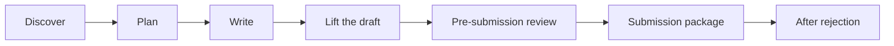
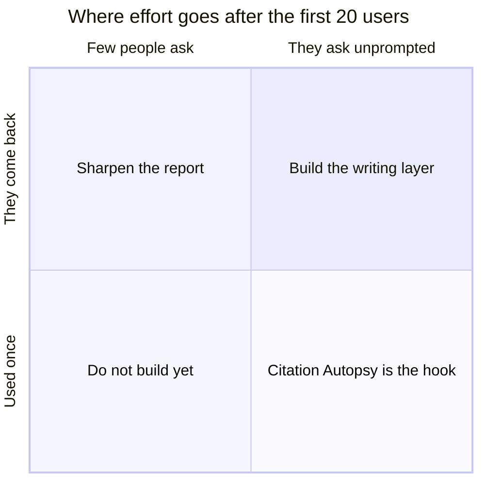
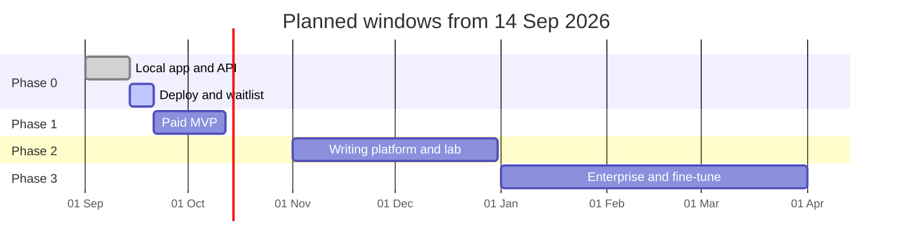
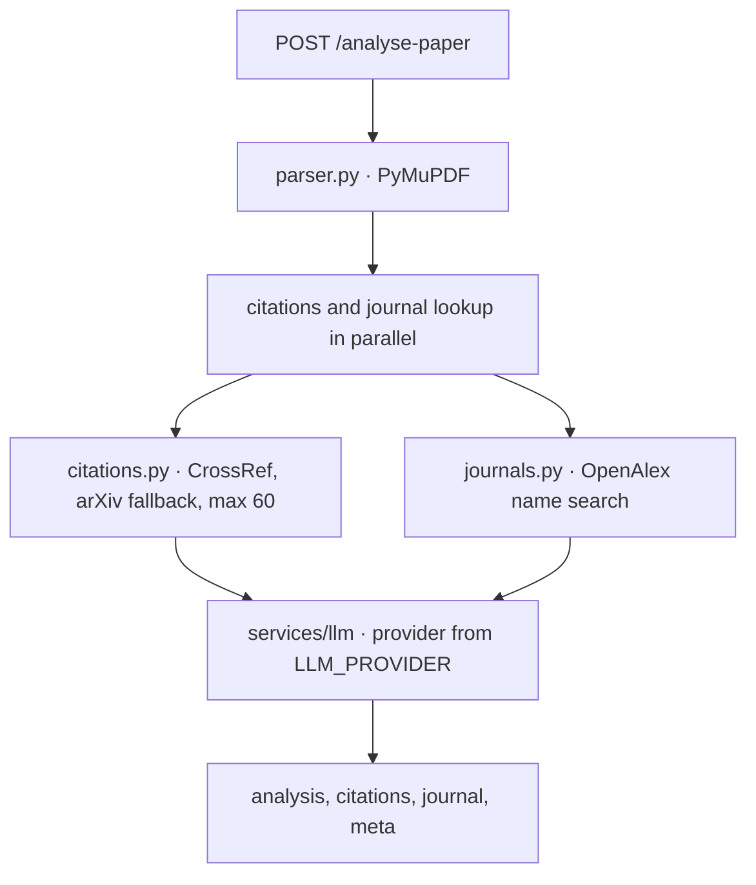
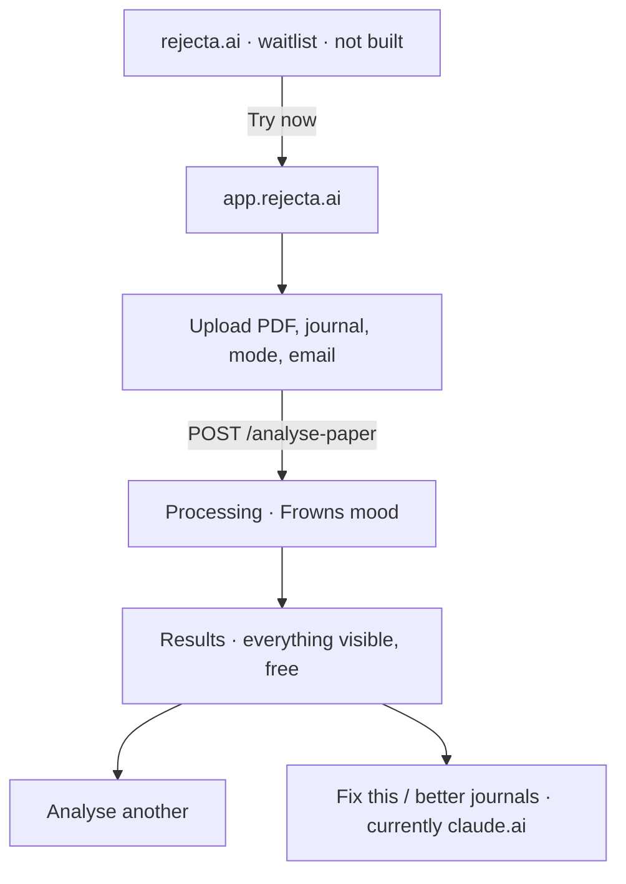
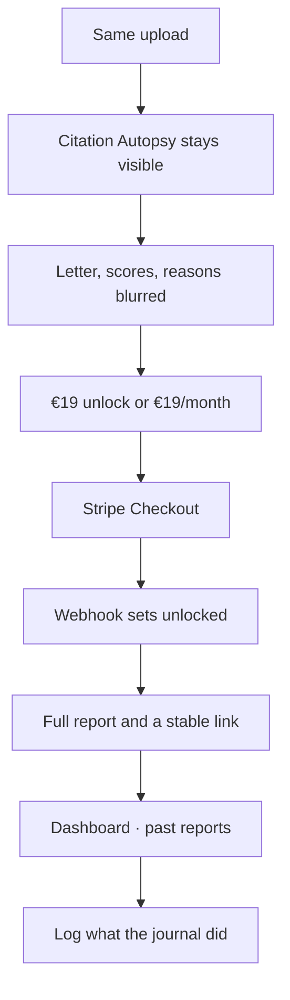
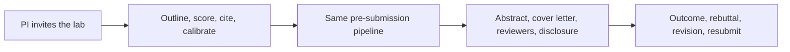
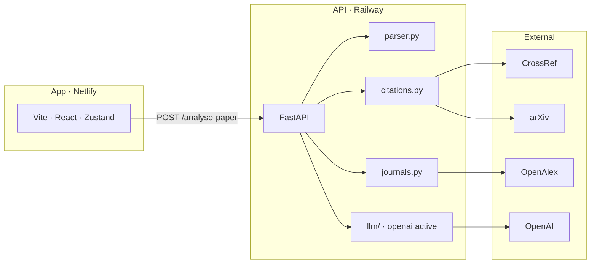
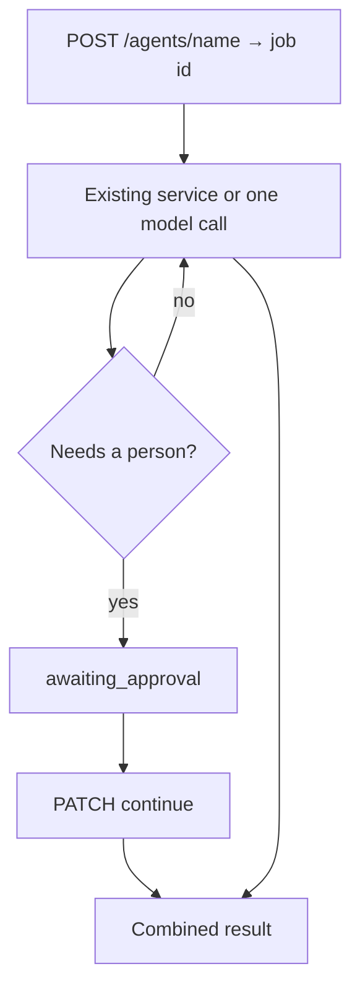

# Rejecta — product roadmap

**The desk rejection you never got.**

Last updated: 14 September 2026. Status marks below are against this repo, not against the original brief. Where the brief said the frontend was unbuilt, that is no longer true.

A research writing companion from the first blank page through an accepted manuscript. It catches ghost citations, lifts AI-drafted prose, scores sections for substance, and says what an editor would reject before submission.

Existing tools fix grammar. Rejecta works on substantive rejection risk — the reason most papers at selective journals never reach peer review.

No competitor covers that arc. The prototype only covers the review step. Everything else on this page is sequenced after that step earns a second use.

---

## Read this first

Three questions the prototype has to answer before the rest of this roadmap is more than a list.

| # | Question | What a yes means |
|---|---|---|
| 1 | Which result do they forward? | Oracle letter → substance is the product. Citation Autopsy → verification is the product. Double down on whichever one they share. |
| 2 | Do they come back mid-draft? | A checker is used once per paper. A return during writing means this is a companion, and pricing and retention change. |
| 3 | Do they ask about AI-drafted prose unprompted? | Voice Calibrator is a pull feature. Build it as field-specific register matching with a before/after score, not as a side tool. |

Until those answers exist, do not start agents, SSO, or a fine-tuned model.

---

## Status on 14 September 2026

| Layer | Mark | What is true in the repo |
|---|---|---|
| API prototype | Done | Six endpoints. Pipeline verified on a sample PDF. |
| App prototype | Done locally | Upload, processing, and results exist in `rejecta-frontend/`. Not deployed. |
| Distribution | Not started | No `rejecta.ai` site. Not on Railway or Netlify. |
| Accounts and money | Not started | No database, auth, payments, job queue, or file storage. |
| Writing platform | Not started | Voice Calibrator, forge, rebuttal, agents are design only. |
| Data moat | Not started | Email is accepted and discarded. Nothing is labelled with an outcome. |

Active model: `LLM_PROVIDER=openai`, `OPENAI_MODEL=gpt-4o`. Anthropic and Hugging Face adapters are in code and unused until `.env` changes.

**Phase 0 is the open phase.** The product surfaces are built. The remaining work this week is to put them in front of 20 researchers.

Dates are planning windows, not commitments. Phase 1 does not start because the calendar says so. It starts when someone asks to pay, or comes back with a second paper.

---

## What the product is

| Piece | Role | Now |
|---|---|---|
| Citation Autopsy | Free hook. Every reference checked. No account. | Working, shown to everyone on the results page. |
| Professor Frowns | Paid product. First-person verdict, section scores, reasons scaled to journal tier, submission package later. | Verdict and scores ship free in the prototype. No paywall. |
| Voice Calibrator | Not "undetectable AI." Undeniably good writing. Rewrites AI-drafted sections into the journal's register without stripping technical content. | Not built. |
| Outcome log | The moat. What happened after submission becomes a dataset no grammar tool can copy. | Not built. Collect from day one of the MVP, even as a form. |

**Positioning line.** Rejecta does not compete on grammar. It competes on why a paper is desk-rejected.

**Humanizer line.** Never say bypass, undetectable, or evade. The buyer is a researcher, not a student trying to hide a draft.

---

## What is built

### API

Stack: FastAPI, Python 3.12, Uvicorn, Pydantic v2. Planned host: Railway. CrossRef, arXiv, and OpenAlex are live. OpenAI is the active provider.

| Method | Path | What it does | Mark |
|---|---|---|---|
| `GET` | `/health` | Process, environment, active provider | Done |
| `POST` | `/parse` | PDF to abstract, sections, references, word count | Done |
| `POST` | `/citations` | Each reference: verified, ghost, or unverified | Done |
| `POST` | `/journal-match` | Journal name to OpenAlex source plus up to 5 recent papers | Done |
| `POST` | `/analyse` | Already-extracted text to a Frowns critique | Done |
| `POST` | `/analyse-paper` | PDF, journal, mode, email. The only call the app makes | Done |

`POST /analyse-paper` validates the file, parses it, runs citations and journal lookup at the same time, then calls the LLM.

Checked on 14 Sep 2026:

- Real DOIs come back verified. A fake DOI comes back ghost. A reference with no DOI comes back unverified. arXiv fallback exists.
- The letter referred to the uploaded paper (sample size, AUROC), not generic advice.
- A made-up journal name returns `found=false`. A real name returns the source. The abstract is not used. Semantic fit is a later feature. The fit paragraph is the model's reading of recent papers, not a vector match.
- A whitespace journal name returns HTTP 400. Email is validated, then dropped.

Known limits, not bugs: PDF only, 10 MB, heading-pattern parser, name-only journal search, request stays open until the model returns. A 45 second paper is possible. Railway's proxy will hold a request for a few minutes if it stays active. A queue is still the right fix before real traffic.

### App

Stack: Vite, React, TypeScript, Tailwind, Zustand, React Router. Local: `http://127.0.0.1:5173`. Planned host: Netlify at `app.rejecta.ai`. CORS already allows that origin and localhost.

| Screen | Mark | Notes |
|---|---|---|
| Upload | Done | PDF drop zone, journal, mode toggle, email. Copy already says the full report is €19. Nothing is charged. |
| Processing | Done | Frowns mood moves with elapsed time. Checklist and progress bar. Not streamed from the API. |
| Results | Done | Mood, score ring, Citation Autopsy, letter, section issue/fix, severity, novelty, journal fit, recent papers, meta strip. |
| Analyse another | Done | Resets and returns to upload. |
| How do I fix this? / Find better journals? | Stub | Both open `https://claude.ai`. Not in-product tools. |
| Waitlist, auth, paywall, dashboard | Not started | |

Results do not survive a refresh. There is no `results/{id}`.

### Not built, on purpose, until the dates below

No auth, payments, database, job queue, file storage, or marketing site until Phase 1, except the waitlist page, which is Phase 0.

---

## Journeys

### Phase 0 — no account

Goal this week: 20 researchers use it on a paper they are about to submit.

Mode `a` is "My paper" and returns issue and fix. Mode `b` is "Someone else's paper" and returns strength and weakness.

Success, in order of how much it matters:

1. They share the letter or the citation table without being asked.
2. The PDF is a paper they intend to submit, not a fixture.
3. They ask about AI-drafted sections without a prompt.
4. They come back with a second paper.

### Phase 1 — first payment

Goal: first paying users, €500 MRR, and a clear answer to which block they pay to see.

Account is created at payment, not at upload. Magic link and Google. The free autopsy never requires one.

### Phase 2 — the lab stays in the product

Goal: €5k MRR, first lab contracts, use on days that are not submission day.

### Phase 3 — the institution

Goal: €15k MRR, one institutional contract, and enough labelled outcomes to start a fine-tune.

Procurement sees SSO, residency, an audit export, and roles before anyone sees a feature demo. Then an admin console, a PI view, a CRIS API, and webhooks. Agents that run without a person in the loop come last, and only with an approval gate.

---

## Feature sequence

### Phase 0 — this week

**Backend.** Done.

- CORS, request logging, one error shape.
- Provider switch: `anthropic`, `openai`, `huggingface`.
- Parser, Citation Autopsy, journal name match, Frowns analysis.
- Concurrent citations and journal lookup inside `/analyse-paper`.

**App.** Done locally. Still to deploy.

- Six Frowns moods, upload, processing, results, `submitPaper()`, Zustand store.

**Distribution.** Not started. This is the actual Phase 0 remainder.

- Waitlist at `rejecta.ai`. Try now goes to `app.rejecta.ai`. No login button until accounts exist.
- API on Railway, app on Netlify. See the run notes in `README.md`.
- Twenty researchers, full access, no paywall.

### Phase 1 — weeks 2 to 4

**Goal.** First euro. Know which block they paid to unblur.

Infrastructure, in this order, because each one unblocks the next:

1. Postgres tables: analyses, citations, users, payments, outcomes.
2. Job queue. `/analyse-paper` returns an id. The app polls status. This is what makes a long paper safe on Railway.
3. Auth at payment: magic link and Google. JWT on later requests.
4. Stripe: €19 once per report. Webhook sets unlocked. €19/month only after the same person comes back.
5. Three free full analyses per IP per day. Autopsy can stay open. The cap is on the expensive path.

Writing and submission tools, built only after the paywall is collecting:

| Tool | Endpoint idea | What it must do |
|---|---|---|
| Voice Calibrator | `POST /voice-calibrate` | Text, field, journal, intensity. Modes: polish, rewrite, restructure. Technical terms unchanged. Before/after signal score. |
| AI signal heatmap | `POST /ai-signal` | Paragraph scores, drawn on the draft. |
| Abstract forge | — | Three abstracts: discoverability, clarity, impact. Each scored by the existing pipeline. |
| Cover letter | — | Journal-specific, three tones. |
| Rebuttal writer | — | Each comment classified. Diplomatic pushback when the reviewer is wrong. |
| Disclosure | — | ICMJE or APA statement that matches what was actually used. |
| Hedge and overclaim | inside `/analyse` | Too soft, or stronger than the data. Calibrated to the field, not to a universal style. |
| Outcome tracker | even a form in v1 | Accepted, rejected, desk rejected, revise and resubmit. This row is the moat. |
| Dashboard | `/dashboard` | Past runs: mood, journal, score, date, link. |

App additions: blur and unlock, login, `/results/{job_id}`.

### Phase 2 — months 2 to 3

**Goal.** €5k MRR. A lab pays €149/month because the PI can see papers in flight.

From a blank page, not from a finished PDF:

- Outline from the last 30 papers accepted at the target journal: section order, word budget, structure.
- Argument scaffold from hypothesis and findings.
- Three contribution frames: novelty, method, impact.
- Register matcher: the calibrator aimed at that journal's published voice, not "academic English."
- Cite-as-you-write: a claim yields three OpenAlex papers and a reason. Insert updates the autopsy.
- Voice breaks across sections and co-authors.
- Statistical reporting check: effect size with the p-value, interval, n, test name, field convention.
- Methods checklist: CONSORT, ARRIVE, STROBE, whichever fits.
- Five reviewers, semantic match, conflict check for institution, co-authorship, and citation.

Agents are sequences of services that already exist, plus one model call. They run as jobs. A person approves before the next step. `POST` returns an id. A waiting state is `awaiting_approval`. Continue is a `PATCH`.

| Agent | What it does | When it runs |
|---|---|---|
| Literature gap | Question, ~60 papers, clusters, three frames with evidence | 60–90 seconds, on demand |
| Competitor monitor | Weekly embed of new papers, alert if one is close to a draft | Scheduled, no one watching |
| Journal intelligence | Watchlist: rates, board, special issues, topic speed | Scheduled |
| Submission package | Analysis, three journals, letter, reviewers, format check | Overnight, gate at each step |
| Revision | Classify comments, rebuttal, which sections to edit, revision letter | On demand |
| Synthesis | 5–20 uploaded papers: consensus, contradictions, where this paper sits | On demand |

Lab tier includes 5 seats, unlimited analyses, a PI board, usage, an API key, webhooks, and these agents.

### Phase 3 — months 4 to 6

**Goal.** €15k MRR. One institution. Fine-tune only if outcome rows are near 5,000.

Sold to procurement, then to researchers:

- SSO: SAML, Okta, Azure AD.
- Audit export: who uploaded what, which run, who opened the result.
- Roles: admin, PI, researcher. Different features, not just a label.
- Residency in writing. Manuscripts do not leave the stated jurisdiction and are not used for training. The API terms already point this way. The contract has to say it.
- Admin console: seats, volume, billing export.
- A status page and a 99.9% SLA only after there is a track record to attach it to.
- White-label if a university wants its own name on it.

Then, and only on a contract:

- Systematic review: criteria, PubMed plus OpenAlex plus Semantic Scholar, screening, extraction, PRISMA summary.
- Grant agent: publication list and a call, NIH / UKRI / ERC shape, human gates. Ask for this in sales calls. Do not build it on a hunch.
- A field-specific analysis add-on for one discipline at one institution.
- Department rates and time-to-acceptance, compared with peer institutions, only if the data is theirs to show.

### The moat, in the order it can exist

| Asset | Earliest | Why it cannot be copied by shipping a prompt |
|---|---|---|
| Outcome-labelled runs | Month 4, if logging starts in week 2 | Fine-tune needs about 5,000 labelled outcomes. Grammar tools do not have this table. |
| Editor plugin | Month 3, if people write inside the product | Scoring in Word or Overleaf is the habit. A website they visit once is not. |
| Publisher embed | Month 6, if a publisher agrees | Report before the editor opens the file. Distribution, not a feature. |
| ORCID | When recommendations need a history | Where they already publish, not a cold journal guess. |

Do not start the fine-tune, the plugin, or publisher talks because the month number arrived. Start them because the previous phase produced the input they need: labelled rows, writing-phase use, or a publisher conversation.

---

## Price

| Tier | Price | Buyer | Includes |
|---|---|---|---|
| Scout | €0 | Anyone | Unlimited Citation Autopsy. Mood preview. No account. |
| Researcher | €19/month | One person | 20 analyses, letter, scores, fit, calibrator, rebuttal, abstracts, cover letter, disclosure. |
| One report | €19 once | Someone who will not subscribe | The same report, no seat. |
| Lab | €149/month | A group | Unlimited analyses, 5 seats, PI board, agents, API, outcome log, competitor monitor. |
| Enterprise | €2k–15k/month | University, company, institute | Seats, SSO, audit, roles, residency, field model, grant agent, SLA, white-label. |

Scout stays free even after the paywall. If autopsy is what they share, charging for it kills the hook.

---

## Against the grammar tools

Marks are the target, not today's build. A tilde means partial or planned.

| Capability | Rejecta | Paperpal | Writefull | Trinka |
|---|---|---|---|---|
| Citation verification | Done · CrossRef and arXiv | No | No | No |
| Desk-rejection risk | Done · the core report | No | No | No |
| Section substance scores | Done | No | No | No |
| Journal fit | Partial · name search plus a fit paragraph. Semantic match is not built | Keyword | No | Keyword |
| Voice calibration | Planned · quality, not evasion | No | No | No |
| Rebuttal writer | Planned | No | No | No |
| Agents | Planned | No | No | No |
| Grammar | Out of scope | Strongest | Strongest for STEM | Strongest for medicine |
| Word or Overleaf | Planned month 3 | Yes | Yes | Yes |
| Outcome dataset | Planned from week 2 | No | No | No |

---

## Architecture

Phase 1 adds Postgres, a queue, object storage for the PDF, and email for the report. Phase 2 agents sit beside the four services and call them. They do not replace them.

Planned agent modules, not files yet: `literature_gap`, `submission_pipeline`, `competitor_monitor`, `revision`, `systematic_review`.

---

## Build order

### This week

- [x] Three screens, local end-to-end on a sample PDF
- [ ] Railway for the API, Netlify for the app
- [ ] `VITE_API_URL` pointing at the deployed API. Provider key already set locally as OpenAI. Set the same key on Railway. Do not switch to Anthropic unless you mean to.
- [ ] Waitlist at `rejecta.ai`. Try now only. No login.
- [ ] Twenty researchers, full free access

### Week 2

- [ ] Analyses and users tables
- [ ] Queue, so a long paper does not sit on one HTTP call
- [ ] €19 Stripe unlock
- [ ] Three free full analyses per IP per day
- [ ] Voice Calibrator
- [ ] Rebuttal writer
- [ ] Outcome log, even if v1 is a form

### Weeks 3 to 4

- [ ] AI signal heatmap, abstract forge, cover letter, disclosure
- [ ] Dashboard and magic-link or Google login
- [ ] €19/month only if the same people return
- [ ] Hedge and overclaim inside the existing analysis

### Months 2 to 3

- [ ] Literature gap agent, outline builder, register matcher, competitor monitor
- [ ] Org, seats, PI board, lab API keys
- [ ] First enterprise conversations, not a build

### Months 4 to 6

- [ ] SSO, audit log, roles
- [ ] Systematic review and grant agent only against a contract
- [ ] Editor plugin only if usage is during writing, not only at submit
- [ ] Fine-tune only near 5,000 labelled outcomes

---

## Risks

| Risk | Level | What to do |
|---|---|---|
| They do not trust the verdict | High | Twenty people, full access. Watch whether a real submission changes. |
| One researcher cannot pay the company | High | Talk to a university in month 2. One contract can exceed 200 individual seats. |
| A publisher builds the same report | Medium | Speed to outcome rows and a contract. A prompt is not the moat. The labelled set is. |
| Voice Calibrator gets described as a detector bypass | Medium | Ban that language in the product and on the site. Sell a better paragraph. |
| A long paper dies on a proxy timeout | Low | Queue in week 2. Known. |
| Model quality moves around | Low | One env var switches provider. JSON parse already falls back. |

---

## Explicitly not now

- Auth, payments, and a database before week 2
- A login button on `rejecta.ai` before accounts exist
- Dark mode, a mobile app, grammar checking, plagiarism detection
- Peer-reviewer assignment for the publisher side
- Semantic journal matching until name search plus the fit paragraph is not enough
- Agents, SSO, and a fine-tune before the three questions at the top have answers

---

## Next action

Deploy the API and the app. Put Try now on `rejecta.ai`. Send `app.rejecta.ai` to 20 researchers with full access. Write down which block they forward.
